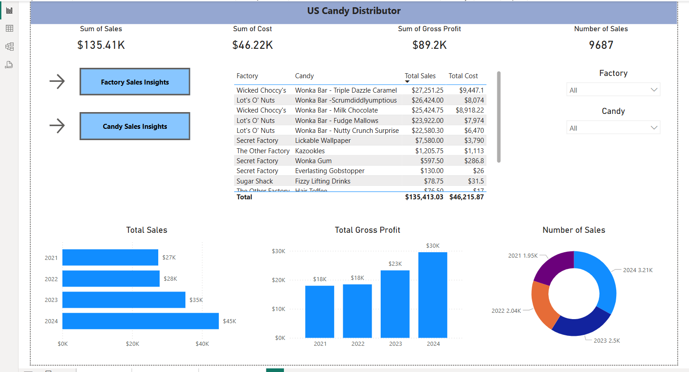
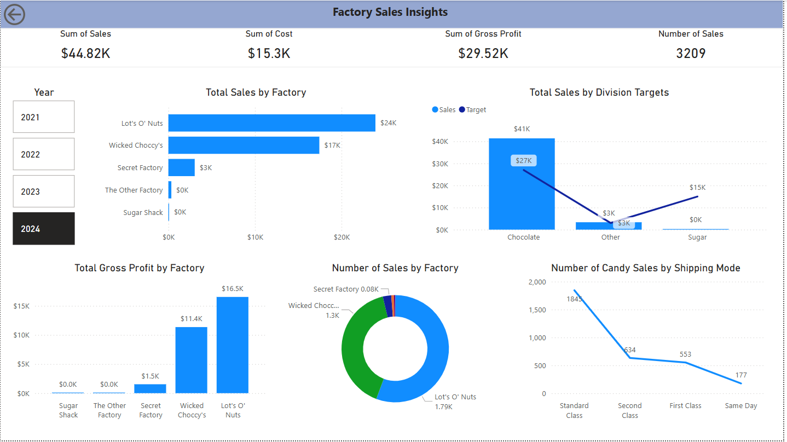
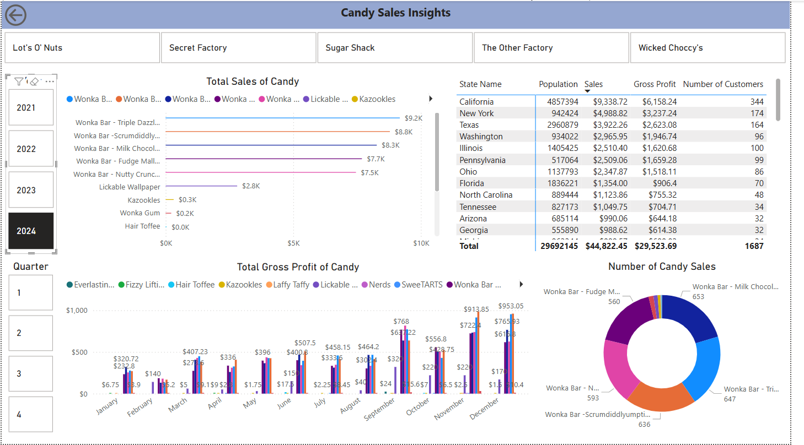
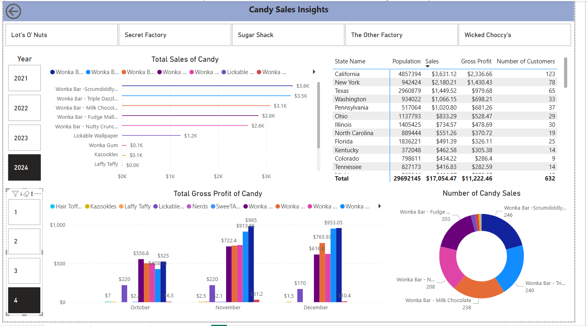
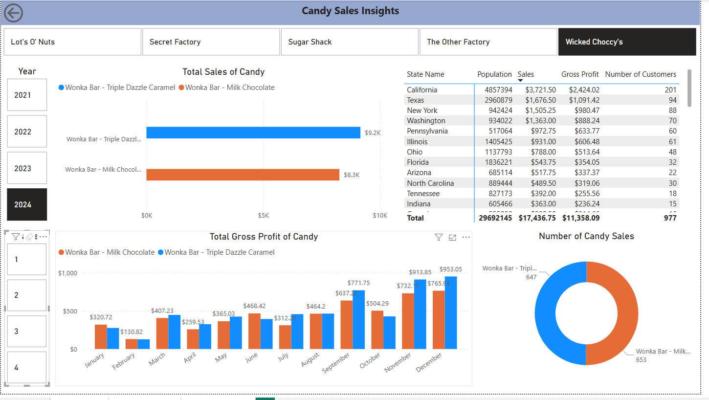

# US Candy Distributor 

## Table of Contents

- [Background and Overview](#background-and-overview)
    - [Introduction](#introduction)
    - [Objective](#objective)
      - [Scope](#scope)
- [Data Structure](#data-structure)
    - [Figure 1: Entity Relationship Diagram](#figure-1:-entity-relationship-diagram)
- [Executive Summary](#executive-summary)
    - [Overview of Findings](#overview-of-findings)
        - [Figure 2: Overview Dashboard](#figure-2:-overview-dashboard)
    - [Factory Sales Insight for 2024](#factory-sales-insight-for-2024)
        - [Figure 3: Factory Sales 2024 Dashboard ](#figure-3:-factory-sales-2024-dashboard)
    - [Candy Sales Insight for 2024](#candy-sales-insight-for-2024)
        - [Figure 4: Candy Sales 2024 Dashboard](#figure-4:-candy-sales-2024-dashboard)
        - [Figure 5: Candy Sales 2024 Q4 Dashboard](#figure-5:-candy-sales-2024-q4-dashboard)
        - [Figure 6: Wicked Choccy's Candy Sales 2024 Dashboard](#figure-6:-wicked-choccy's-candy-sales-2024-dashboard)
- [Recommendations](#recommendations)

## Background and Overview
### Introduction
The US candy industry is a multi-billion dollar market consisting of a diverse range of products. This project aims to analyse a dataset of US Candy Distributor obtained from Maven Analytics to uncover the key trends, consumer preferences and opportunities for market growth in the US. The US Candy Distributor has a partnership with five candy factories to distribute 15 different types of candies to customers.

### Objective
The primary objective of this analysis is to provide a detailed understanding of sales dynamics within the US candy market. This includes identifying the most popular candy types and sales trends from 2021 to 2024. By achieving these objectives, we aim to offer the distributor actionable information to enhance their market position and priorities on candies customers love. 

#### Scope
This analysis will encompass the following key areas:
1.	Factory analysis: evaluating the sales data across different factories to uncover each factory's profitability.
2.	Sales trends: examination of monthly, seasonal, and annual sales patterns to figure out peak periods and potential growth opportunities.
3.	Product performance: determine the best-selling candies.

The raw data can be downloaded [here](https://maven-datasets.s3.amazonaws.com/US+Candy+Distributor/US+Candy+Distributor.zip).

The date table can be found [here](https://github.com/RobelGiday/candy_sales/blob/main/date_details.csv).

The SQL queries utilised to clean, organise, and prepare raw data for the dashboard can be found [here](https://github.com/RobelGiday/candy_sales/blob/main/Data%20Cleaning%20US%20Candy%20Distributor.sql).

An interactive Power BI dashboard can be downloaded [here](https://github.com/RobelGiday/candy_sales/raw/refs/heads/main/Candy_Sales.pbix).

## Data Structure
The US Candy Distributor database structure, as seen in Figure 1 consists of six tables: date, location, candy_sales, candy_products, candy_targets and candy_factories with a total row count of 13 993 records. This analysis does not include the candies sales to Canada.

#### Figure 1: Entity Relationship Diagram

## Executive Summary
### Overview of Findings
From 2021 to 2024, the total sales increased steadily, with the highest revenue in 2024 of $45K. Key findings include:
* Top Performers:
    * Lot's O' Nuts is the largest contributor, responsible for 53.85% of total sales.
    * The Wonka Bar - Triple Dazzel Caramel from Wicked Choccy's generated the highest revenue of $27.25K, followed closely by Lot's O' Nuts Wonka Bar - Scrumdidlyumptious which achieved $26.42k in sales.
* Under Performers:
    * Sugar Shack contributes only 0.16% of the total sales, amounting to $220.98.
    * Sugar Shack's Fun Dip was the lowest-selling candy with just $12 in sales.
* Yearly Growth: Starting in 2023 sales grew at an average rate of 27% per year, driven by increased demand for popular candies.
* Profitability: Gross profit reached $30K in 2024.

#### Figure 2: Overview Dashboard

### Factory Sales Insight for 2024
* Factory Performance
    * Lot's O' Nut's consistently led total sales. In 2024 it generated $24k in sales, netting $16.5k profits with 1.79k sale transactions
    *  This was followed by Wicked Choccy's, which achieved $17K in sales, $11.4k in gross profits and 1.3k in sale transactions.
    *  In contrast, Secret Factory generated only $3k in sales, while The Other Factory and Sugar Shack were non-contributors with less than $500 in sales and $50 in profits.
* Divisional Targets
     * The Chocolate division accounted for 91% of total sales and exceeded its target by 152%.
     * Similarly, the Other division surpassed its target by 112%, whereas the Sugar Division missed its target entirely.
* Shipping preferences
    * Standard class was the most utilised shipping method, accounting for 60% of transactions. This indicates its cost-effectiveness and customer preference.
    * Limited usage of Same Day shipping of 177 transactions suggests it is less critical to overall operations.

#### Figure 3: Factory Sales 2024 Dashboard 

 
### Candy Sales Insight for 2024
* Product Performance
    *  Wonka Bar - Triple Dazzel Caramel generated the highest revenue, with $9.2K in sales.
    *  Wonka Bar - Scrumdidlyumptious was the most profitable candy, netting $6.1K in profits. 
    *  Wonka Bar - Milk Chocolate was the best-selling candy, with 653 candy sales.
    *  Overall, Wonka Bars from both Lot's O Nuts and Wicked Choccy's contributed to 92% of the sales in 2024.
    *  Fun Dip recorded no sales in 2024. 
* Seasonal Trends
    * Sales peaked between October and December, with total sales reaching $17.1K.
    * In contrast, the period between January and March accounted for the lowest candy sales of the year, with $6.6K in total sales.    
* Regional Demand
    * California outperformed other regions, netting $6.16K in profits from 344 customers. Regretfully, this represents only 0.007% of the state's population.
    * There is potential for market penetration in highly populated states such as California, Texas and Florida.
 
#### Figure 4: Candy Sales 2024 Dashboard

#### Figure 5: Candy Sales 2024 Q4 Dashboard

#### Figure 6: Wicked Choccy's Candy Sales 2024 Dashboard

## Recommendations
*	Improvement
    *	Strengthen partnerships with high-performing factories like Lot’s O’ Nuts and Wicked Choccy’s to sustain their momentum and meet demand.
    * Reevaluate operations at The Other Factory and Sugar Shack, reallocating resources or shifting focus to high-demand products.
    * Explore growth potential for underperforming but unique candies such as Fun Dip and Nerds.
*	Expand Divisional Performance 
    *	Focus on sustaining the growth of chocolate products while exploring the opportunities to diversify sales across other categories.
    *	Launch targeted campaigns for Sugar and Other divisions to diversify revenue streams and achieve divisional goals.
* Enhance Logistics
    *	Focus on improving Standard Class shipping while reassessing the relevance and efficiency of Same Day shipping.
    *	Strengthen operation and marketing efforts in highly populated states like California, Texas and Florida to maximise returns.
* Leverage Seasonal Trends
    * Strengthen marketing efforts in August to boost pre-holiday sales.
    * Scale inventory in the fourth quarter to meet peak demand.
    * Offer discounts for Valentine's Day and Easter to promote demand in the first quarter.
    * Encourage factories to create holiday-themed candies such as heart-shaped candy, easter eggs, gingerbread men, etc. 

