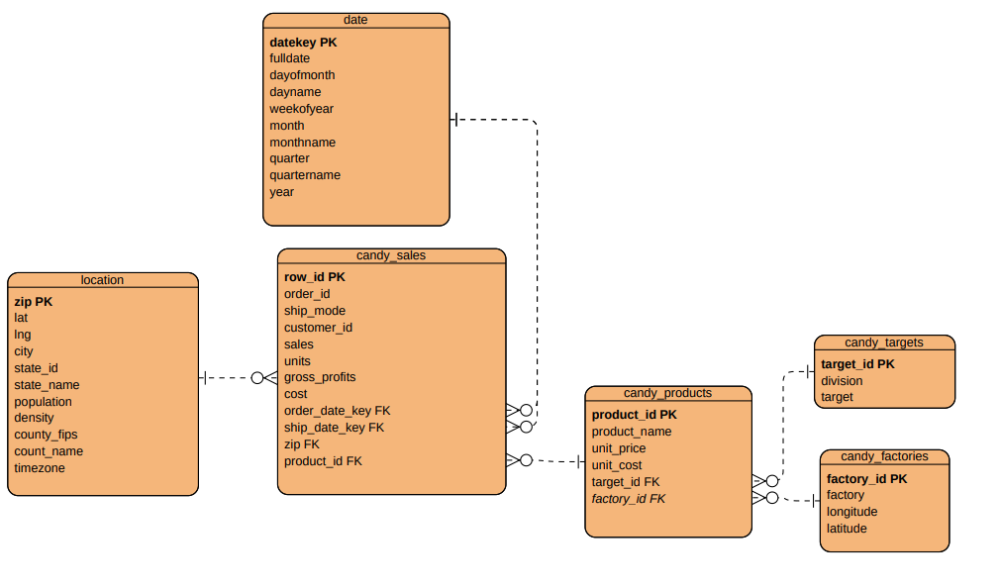

# US Candy Distributor 

# Table of Contents

- [Background and Overview](#background-and-overview)
    - [Introduction](#introduction)
    - [Objective](#objective)
      - [Scope](#scope)
- [Data Structure](#data-structure)

# Background and Overview
## Introduction
The US candy industry is a multi-billion dollar market consisting of a diverse range of products. This project aims to analyse a dataset of US Candy Distributor obtained from Maven Analytics to uncover the key trends, consumer preferences and opportunities for market growth.

## Objective

